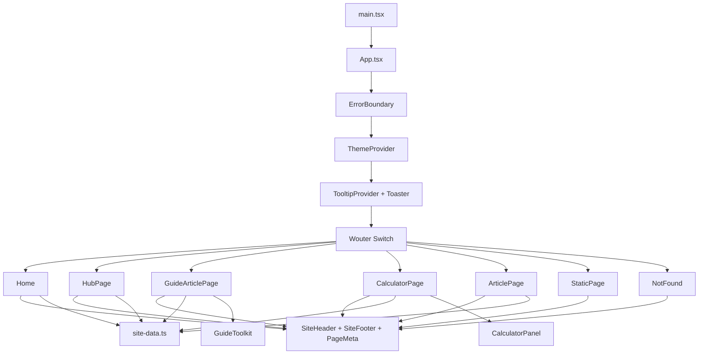

# DigitalSolutions.cv — Project Structure

This reference describes the active project layout. Generated and dependency folders such as `node_modules/`, `dist/`, `.git/`, and `.manus-logs/` are intentionally omitted.

```text
digitalsolutions-custom/
├── client/                              # React frontend
│   ├── index.html                        # Browser document entry point
│   ├── public/                           # Public configuration files
│   │   ├── robots.txt                    # Search-crawler guidance
│   │   └── sitemap.xml                   # Indexed route list
│   └── src/
│       ├── App.tsx                       # Application route table
│       ├── main.tsx                      # React application bootstrap
│       ├── index.css                     # Global theme and shared styles
│       ├── const.ts                      # Frontend constants
│       ├── components/                   # Reusable interface components
│       │   ├── CalculatorPanel.tsx        # Calculator logic and currency preference storage
│       │   ├── GuideToolkit.tsx           # Guide templates and checklist downloads
│       │   ├── SiteHeader.tsx             # Primary navigation and search
│       │   ├── SiteFooter.tsx             # Footer navigation
│       │   ├── PageMeta.tsx               # Page title, description, canonical metadata and optional FAQ structured data
│       │   ├── ErrorBoundary.tsx          # Frontend error fallback
│       │   ├── Map.tsx                    # Optional map component
│       │   ├── ManusDialog.tsx             # Shared dialog component
│       │   ├── home-aeo.css               # Homepage direct-answer, decision-canvas and FAQ layout
│       │   ├── business-software-solutions-aeo.css # Business Software Solutions table, evidence and FAQ layout
│       │   ├── business-software-solutions-variation.css # Split-window operating-fit instrument for the Business Software Solutions page
│       │   ├── CrmStartupsAeo.tsx                 # CRM Software for Startups direct answer, provider table, implementation guide and FAQ content
│       │   ├── crm-startups-aeo.css               # CRM Software for Startups evidence, motion map, fit instrument and FAQ layout
│       │   └── *.css                      # Component-specific visual systems
│       ├── contexts/
│       │   └── ThemeContext.tsx           # Theme state
│       ├── hooks/                         # Reusable React hooks
│       │   ├── useComposition.ts
│       │   ├── useMobile.tsx
│       │   └── usePersistFn.ts
│       ├── lib/                           # Content and utility modules
│       │   ├── site-data.ts               # Hubs, calculators, articles, guides and navigation data
│       │   ├── keyword-pages.ts           # Shared keyword landing-page registry
│       │   ├── seo-keyword-pages.ts       # Accounting, invoicing, AI, productivity, marketing, free-tool and comparison keyword clusters
│       │   ├── longtail-keyword-pages.ts  # First supplied long-tail keyword expansion registry
│       │   ├── operations-growth-pages.ts # Second supplied operations, growth, AI, document, website and SEO keyword registry
│       │   ├── specialist-software-pages.ts # Third supplied specialist software, utility and practical-search keyword registry
│       │   ├── high-intent-keyword-pages.ts # Researched high-intent software and workflow keyword registry
│       │   ├── strategic-technology-pages.ts # Fourth supplied strategic technology, transformation, workflow, data, growth and security keyword registry
│       │   ├── small-business-pillar-pages.ts # Fifth supplied small-business pillar and supporting-page keyword registry
│       │   ├── topic-authority.ts          # Ten pillar pathways and cluster-to-pillar mapping
│       │   ├── calculator-definitions.ts   # Calculator keywords, metadata and assumptions
│       │   └── utils.ts                   # Shared utilities
│       └── pages/                         # Route-level page components
│           ├── Home.tsx                   # Business-software homepage with direct answer, cited research context, FAQ and internal pathways
│           ├── HubPage.tsx                # Content hubs, including Business Guides
│           ├── GuideArticlePage.tsx       # Planning, productivity, marketing and cybersecurity guides
│           ├── KeywordLandingPage.tsx      # SEO landing pages, including Business Software Solutions and CRM Software for Startups direct-answer, evidence, FAQ and schema modules
│           ├── TopicAuthorityPage.tsx      # Connected topic-map and pillar discovery route
│           ├── CalculatorPage.tsx          # Calculator route wrapper
│           ├── ArticlePage.tsx            # Reviews and comparison articles
│           ├── StaticPage.tsx             # Company and policy pages
│           └── NotFound.tsx               # 404 page
├── server/
│   └── index.ts                           # Static production-server entry point
├── shared/
│   └── const.ts                           # Shared compatibility constants
├── patches/
│   └── wouter@3.7.1.patch                 # Router dependency patch
├── package.json                           # Dependencies and scripts
├── pnpm-lock.yaml                         # Locked dependency versions
├── vite.config.ts                         # Vite configuration
├── tsconfig.json                          # TypeScript configuration
├── tsconfig.node.json                     # Node TypeScript configuration
├── components.json                        # Component-library configuration
├── ideas.md                               # Design direction and decisions
├── PROJECT_STRUCTURE.md                   # This folder hierarchy reference
├── implementation-report.md               # Previous implementation notes
├── article-plan-verified-batch.md         # Article planning notes
├── research-notes-verified-batch.md       # Supporting research notes
├── migration-map.md                       # Route and migration reference
└── todo-ik4kgiho.md                       # This session’s task checklist
```

## Static assets outside the project

Large assets are intentionally kept outside the frontend repository:

```text
/home/ubuntu/webdev-static-assets/
└── digitalsolutions-guide-checklists/
    └── pdf-source/                        # Source, verification and review artifacts for guide checklists
```

The deployed application references uploaded storage URLs rather than local asset paths. This keeps deployment bundles focused on the application code while preserving downloadable resources.

## Route map and component connections

The client boots through `client/src/main.tsx`, which mounts `App.tsx`. `App.tsx` applies the global error boundary, theme provider, tooltip provider and toast layer before the Wouter route switch selects a page component.



### Global route shell

| Layer | Source | Responsibility | Connected modules |
|---|---|---|---|
| Application bootstrap | `client/src/main.tsx` | Mounts the React application. | `App.tsx` |
| Application shell | `client/src/App.tsx` | Defines all client-side URL patterns and global providers. | Wouter, `ErrorBoundary`, `ThemeContext`, shadcn tooltip/toast components |
| Shared page shell | `SiteHeader.tsx`, `SiteFooter.tsx` | Provides primary navigation, search, brand lock-up and footer links. | `hubs`, `searchItems`, `footerGroups` from `site-data.ts` |
| SEO layer | `PageMeta.tsx` | Applies title, description, Open Graph details and canonical URL for each rendered route. | Called from every page component |
| Content registry | `client/src/lib/site-data.ts` | Stores hub, calculator, guide, review and comparison content plus internal paths. | Home, hub, guide, calculator and article pages |

### Primary and hub routes

| URL | Page component | Data and linked components | Purpose |
|---|---|---|---|
| `/` | `Home.tsx` | `PageMeta`, `SiteHeader`, `SiteFooter`, `hubs`, `calculatorTools` | Homepage, with category cards leading into all main content areas. |
| `/business-software/` | `HubPage.tsx` with `hubKey="business-software"` | `hubs`, `SiteHeader`, `SiteFooter`, `PageMeta` | Business software topic hub. |
| `/ai-tools/` | `HubPage.tsx` with `hubKey="ai-tools"` | `hubs`, `SiteHeader`, `SiteFooter`, `PageMeta` | AI tools topic hub. |
| `/free-tools/` | `HubPage.tsx` with `hubKey="free-tools"` | `hubs`, `calculatorTools`, `SiteHeader`, `SiteFooter`, `PageMeta` | Calculator index. Each card opens a calculator route. |
| `/reviews/` | `HubPage.tsx` with `hubKey="reviews"` | `hubs`, `verifiedArticles`, `SiteHeader`, `SiteFooter`, `PageMeta` | Software review hub with links to review articles. |
| `/comparisons/` | `HubPage.tsx` with `hubKey="comparisons"` | `hubs`, `verifiedArticles`, `SiteHeader`, `SiteFooter`, `PageMeta` | Software comparison hub with links to comparison articles. |
| `/business-guides/` | `HubPage.tsx` with `hubKey="business-guides"` | `hubs`, `guideArticles`, `SiteHeader`, `SiteFooter`, `PageMeta` | Guide index. Each card maps by position to a dedicated guide article. |
| `/topic-authority/` | `TopicAuthorityPage.tsx` | `topic-authority.ts`, `keywordLandingPages`, `SiteHeader`, `SiteFooter`, `PageMeta` | Topic-map hub for the ten decision pillars, related clusters, core routes and editorial method. |

### Calculator routes

All calculator routes use `CalculatorPage.tsx`, which locates the relevant calculator definition in `calculatorKeywordTools` and renders `CalculatorPanel.tsx`. The panel saves the selected currency under the browser local-storage key `digitalsolutions.display-currency`, so the preference is shared across calculator routes and future visits in the same browser. Each calculator route also renders reciprocal links to related calculator pages.

| URL | `:slug` | Calculator view | Primary connections |
|---|---|---|---|
| `/tools/vat-calculator/` | `vat-calculator` | Add or remove a specified VAT rate. | `CalculatorPage` → `CalculatorPanel` → saved currency preference |
| `/tools/profit-margin-calculator/` | `profit-margin-calculator` | Calculates profit and margin from revenue and cost. | `CalculatorPage` → `CalculatorPanel` → saved currency preference |
| `/tools/break-even-calculator/` | `break-even-calculator` | Estimates units and revenue required to cover fixed costs. | `CalculatorPage` → `CalculatorPanel` → saved currency preference |
| `/tools/freelance-rate-calculator/` | `freelance-rate-calculator` | Estimates an indicative daily and hourly rate. | `CalculatorPage` → `CalculatorPanel` → saved currency preference |
| `/tools/sales-tax-calculator/` | `sales-tax-calculator` | Adds or removes an entered sales-tax rate. | `CalculatorPage` → `CalculatorPanel` → saved currency preference |
| `/tools/gross-profit-margin-calculator/` | `gross-profit-margin-calculator` | Calculates gross profit and margin. | `CalculatorPage` → `CalculatorPanel` → saved currency preference |
| `/tools/break-even-point-calculator/` | `break-even-point-calculator` | Estimates the point where revenue covers costs. | `CalculatorPage` → `CalculatorPanel` → saved currency preference |
| `/tools/hourly-rate-calculator/` | `hourly-rate-calculator` | Estimates an indicative hourly rate. | `CalculatorPage` → `CalculatorPanel` → saved currency preference |
| `/tools/salary-calculator/` | `salary-calculator` | Estimates monthly, weekly and hourly gross pay. | `CalculatorPage` → `CalculatorPanel` → saved currency preference |
| `/tools/take-home-pay-calculator/` | `take-home-pay-calculator` | Estimates take-home pay from an entered deduction rate. | `CalculatorPage` → `CalculatorPanel` → saved currency preference |
| `/tools/business-loan-calculator/` | `business-loan-calculator` | Estimates repayments from amount, rate and term. | `CalculatorPage` → `CalculatorPanel` → saved currency preference |
| `/tools/roi-calculator/` | `roi-calculator` | Calculates indicative return on investment. | `CalculatorPage` → `CalculatorPanel` → saved currency preference |
| `/tools/commission-calculator/` | `commission-calculator` | Calculates indicative commission from sales and rate. | `CalculatorPage` → `CalculatorPanel` → saved currency preference |

### Business guide routes

All guide URLs resolve through `GuideArticlePage.tsx`. The route parameter selects an object from `guideArticles` in `site-data.ts`. Each guide page combines the shared site shell, a topic-specific editorial specimen, an interactive `GuideToolkit`, three content sections and related-resource links.

| URL | `:slug` | Topic-specific layout | Interactive and download connection |
|---|---|---|---|
| `/business-guides/planning/` | `planning` | Decision brief specimen and planning-led page rhythm. | `GuideToolkit` shows a decision brief template and links to the Planning checklist PDF. |
| `/business-guides/productivity/` | `productivity` | Workflow map specimen with offset productivity sections. | `GuideToolkit` shows a workflow-reset template and links to the Productivity checklist PDF. |
| `/business-guides/digital-marketing/` | `digital-marketing` | Signal-path specimen with message-path section treatment. | `GuideToolkit` shows a signal-planner template and links to the Digital Marketing checklist PDF. |
| `/business-guides/cybersecurity/` | `cybersecurity` | Safeguard-matrix specimen with an access-and-response rhythm. | `GuideToolkit` shows a safeguards-note template and links to the Cybersecurity checklist PDF. |

`GuideToolkit.tsx` stores each guide’s working notes locally using the key pattern `digitalsolutions.guide-template.<slug>`. The downloaded PDFs are uploaded static assets referenced through their `/manus-storage/…pdf` URLs.

### Review and comparison article routes

`ArticlePage.tsx` chooses an entry from `verifiedArticles` in `site-data.ts`. The same page component adapts its hub breadcrumb, labels, source section and article data according to whether the entry is a review or comparison.

| URL | `:slug` | Article type | Source connection |
|---|---|---|---|
| `/reviews/xero/` | `xero` | Review | `verifiedArticles` → official Xero source list |
| `/reviews/quickbooks/` | `quickbooks` | Review | `verifiedArticles` → official QuickBooks source list |
| `/comparisons/xero-vs-quickbooks/` | `xero-vs-quickbooks` | Comparison | `verifiedArticles` → Xero and QuickBooks source lists |
| `/comparisons/freeagent-vs-xero/` | `freeagent-vs-xero` | Comparison | `verifiedArticles` → FreeAgent and Xero source lists |
| `/comparisons/google-workspace-vs-microsoft-365/` | `google-workspace-vs-microsoft-365` | Comparison | `verifiedArticles` → Google Workspace and Microsoft 365 source lists |

### Company, policy and fallback routes

`StaticPage.tsx` contains an internal `pages` record. The selected `pageKey` provides the title, description and content sections for each company or policy page.

| URL | `pageKey` | Page component | Content source |
|---|---|---|---|
| `/about/` | `about` | `StaticPage.tsx` | Internal `pages.about` record |
| `/contact/` | `contact` | `StaticPage.tsx` | Internal `pages.contact` record |
| `/editorial-policy/` | `editorial-policy` | `StaticPage.tsx` | Internal policy record |
| `/privacy-policy/` | `privacy-policy` | `StaticPage.tsx` | Internal policy record |
| `/cookie-policy/` | `cookie-policy` | `StaticPage.tsx` | Internal policy record |
| `/terms-conditions/` | `terms-conditions` | `StaticPage.tsx` | Internal policy record |
| `/affiliate-disclosure/` | `affiliate-disclosure` | `StaticPage.tsx` | Internal disclosure record |
| `/advertising-disclosure/` | `advertising-disclosure` | `StaticPage.tsx` | Internal disclosure record |
| `/404` and unmatched paths | — | `NotFound.tsx` | Shared header, footer and `PageMeta` fallback |

### Navigation and internal-link flow

```text
SiteHeader
  ├── Primary navigation → hub routes
  ├── Discover menu → selected hub category links
  └── Search overlay → searchItems from site-data.ts

Home
  ├── Category cards → hubs
  ├── Calculator links → /tools/:slug
  └── Feature links → business software, AI tools and comparisons

HubPage
  ├── Free Tools hub → calculatorTools paths
  ├── Business Guides hub → guideArticles paths
  ├── Reviews/Comparisons hubs → verifiedArticles paths
  └── Other hubs → hub index paths

GuideArticlePage and ArticlePage
  └── Related-resource cards → linked hubs and sibling content routes

SiteFooter
  └── Explore, resources, company and legal links → footerGroups paths
```

### Route styles and supporting assets

The global visual system is owned by `client/src/index.css`. Route-level visual systems are imported by the components that use them: `hub-specimen.css` for hub decision panels, `guide-article.css`, `guide-specimens.css` and `guide-topic-variation.css` for guide articles, `guide-toolkit.css` for interactive templates, `calculator-currency.css` for calculator controls, and `brand-lockup.css` for the shared header identity.

### Keyword landing-page system

The keyword expansion uses `client/src/lib/keyword-pages.ts` as the single source for page titles, primary keywords, URL paths, descriptions, decision prompts, checklists and related links. `client/src/pages/KeywordLandingPage.tsx` renders the shared page pattern, while `client/src/components/keyword-landing.css` owns its editorial category layout. `App.tsx` defines explicit routes for each supplied path, `HubPage.tsx` surfaces the pages under their relevant hub, `searchItems` makes them discoverable through the header search, and `sitemap.xml` lists them for indexing.

| Page | Primary keyword | URL | Route and content connection |
|---|---|---|---|
| Business Software | business software | `/business-software/` | Existing `HubPage` route, linked to focused software category pages. |
| Small Business Software | small business software | `/small-business-software/` | `KeywordLandingPage` → `small-business-software`. |
| Business Tools | business tools | `/business-tools/` | `KeywordLandingPage` → `business-tools`. |
| Digital Tools | digital tools | `/digital-tools/` | `KeywordLandingPage` → `digital-tools`. |
| Online Business Tools | online business tools | `/online-business-tools/` | `KeywordLandingPage` → `online-business-tools`. |
| Free Business Tools | free business tools | `/free-business-tools/` | `KeywordLandingPage` → `free-business-tools`. |
| AI Tools | AI tools | `/ai-tools/` | Existing `HubPage` route, linked to focused AI category pages. |
| AI Tools for Small Business | AI tools for small business | `/ai-tools-for-small-business/` | `KeywordLandingPage` → `ai-tools-for-small-business`. |
| Business Automation Tools | business automation tools | `/business-automation-tools/` | `KeywordLandingPage` → `business-automation-tools`. |
| Productivity Tools | productivity tools | `/productivity-tools/` | `KeywordLandingPage` → `productivity-tools`. |
| Accounting Software | accounting software | `/accounting-software/` | `KeywordLandingPage` → `accounting-software`. |
| CRM Software | CRM software | `/crm-software/` | `KeywordLandingPage` → `crm-software`. |
| Invoicing Software | invoicing software | `/invoicing-software/` | `KeywordLandingPage` → `invoicing-software`. |
| Payroll Software | payroll software | `/payroll-software/` | `KeywordLandingPage` → `payroll-software`. |
| Project Management Software | project management software | `/project-management-software/` | `KeywordLandingPage` → `project-management-software`. |
| Email Marketing Software | email marketing software | `/email-marketing-software/` | `KeywordLandingPage` → `email-marketing-software`. |
| Booking Software | booking software | `/booking-software/` | `KeywordLandingPage` → `booking-software`. |
| Website Builders | website builders | `/website-builders/` | `KeywordLandingPage` → `website-builders`. |

### Business Software reciprocal-link cluster

The Business Software cluster now contains the following seven primary-keyword pages. `KeywordLandingPage.tsx` detects pages in this category and renders a six-link related-page network from the shared Business Software page registry. The link offsets are symmetric, so each rendered category link is reciprocal: every listed page links to at least six other Business Software pages and receives the matching links back.

| Page | Primary keyword | URL |
|---|---|---|
| Business Software | business software | `/business-software/` |
| Business Software Solutions | business software solutions | `/business-software-solutions/` |
| Cloud Business Software | cloud business software | `/cloud-business-software/` |
| Software for Small Business | software for small business | `/software-for-small-business/` |
| Business Productivity Software | business productivity software | `/business-productivity-software/` |
| Business Management Software | business management software | `/business-management-software/` |
| Small Business Software | small business software | `/small-business-software/` |

### CRM reciprocal-link cluster

The CRM cluster uses `crm-pages.ts` for keyword-specific content and `crmClusterSlugs` to render a symmetric six-link network in `KeywordLandingPage.tsx`. Every CRM page links to six related CRM pages, while the Business Software hub lists the CRM category page and the broader category-page collection links into the cluster.

| Page | Primary keyword | URL |
|---|---|---|
| CRM Software | CRM software | `/crm-software/` |
| CRM for Small Business | CRM for small business | `/crm-for-small-business/` |
| Best CRM for Small Business | best CRM for small business | `/best-crm-for-small-business/` |
| Free CRM for Small Business | free CRM for small business | `/free-crm-for-small-business/` |
| Simple CRM Software | simple CRM software | `/simple-crm-software/` |
| CRM Software for Startups | CRM software for startups | `/crm-software-for-startups/` |
| CRM Software Comparison | CRM software comparison | `/crm-software-comparison/` |
| Best Free CRM Software | best free CRM software | `/best-free-crm-software/` |

### Multi-cluster SEO keyword system

`seo-keyword-pages.ts` groups supplied keyword pages by primary topic and provides their primary keyword, route slug, metadata description, intent-led content, workflow signals and fit checklist. `App.tsx` resolves registered single-segment keyword URLs through the final `/:slug/` route, while `KeywordLandingPage.tsx` returns the shared SEO page shell or the standard 404 view for an unknown slug.

| Cluster | Landing-page data source | Parent hub | Linking behaviour |
|---|---|---|---|
| Accounting & Finance | `seo-keyword-pages.ts` plus `accounting-software` | Business Software | Reciprocal Accounting & Finance links, including the existing accounting page. |
| Invoicing & Payments | `seo-keyword-pages.ts` plus `invoicing-software` | Business Software | Reciprocal Invoicing & Payments links, including the existing invoicing page. |
| AI | `seo-keyword-pages.ts` plus related AI pages | AI Tools | Reciprocal AI keyword links with bounded-task and review content. |
| Productivity | `seo-keyword-pages.ts` plus `productivity-tools` | AI Tools | Reciprocal productivity links around friction, ownership and next actions. |
| Marketing | `seo-keyword-pages.ts` plus `email-marketing-software` | Business Software | Reciprocal marketing links around audience, message and learning paths. |
| Free Tools | `seo-keyword-pages.ts` plus existing free-tool pages | Free Tools | Reciprocal free-tool links with visible assumptions and practical next steps. |
| Software Comparisons | `seo-keyword-pages.ts` | Software Comparisons | Reciprocal comparison links and an A/B workflow-evidence specimen. |

All keyword entries are included in `searchItems` through `keywordLandingPages`, surfaced in their parent hub’s category-page collection, supplied with `PageMeta` title, description and canonical URL, and listed in `sitemap.xml`.

### Supplied long-tail keyword page system

`longtail-keyword-pages.ts` contains the expanded keyword inventory from the supplied list. It excludes keywords already covered by the existing Business Software, CRM, multi-cluster and implemented calculator registries, then generates a page object for every remaining slug. Each generated object includes a primary keyword, SEO title, meta description, canonical path, task-led lead copy, decision prompt, workflow signals and fit checklist.

| Intent cluster | Parent hub | Topic-native page treatment | Related-page connection |
|---|---|---|---|
| Business Software | Business Software | Operating-fit page pattern | Six reciprocal Business Software links. |
| AI & Automation | AI Tools | Review-control specimen and bounded-task content | Six reciprocal AI & Automation links. |
| Sales & Customer Operations | Business Software | Customer context and follow-up panel | Six reciprocal sales and customer-operation links. |
| People Operations | Business Software | Record, approval and review panel | Six reciprocal people-operation links. |
| Productivity & Collaboration | AI Tools | Routine and ownership instrument | Six reciprocal productivity and collaboration links. |
| Marketing & Web | Business Software | Audience-to-action workflow | Six reciprocal marketing and web links. |
| Finance & Invoicing | Business Software | Record and billing ledger | Six reciprocal finance and invoicing links. |
| Security & Storage | Business Software | Access and recovery panel | Six reciprocal security and storage links. |
| How-To Guides | Business Guides | Start, map and review guide path | Six reciprocal how-to guide links. |
| Calculator Guides | Free Tools | Inputs and assumptions instrument | Six reciprocal calculator guide links; implemented calculators retain their dedicated `/tools/:slug/` routes. |
| Generators & Utilities | Free Tools | Purpose, input and output-review instrument | Six reciprocal utility links. |
| Comparisons & Alternatives | Software Comparisons | Shared-workflow comparison matrix | Six reciprocal comparison and alternative links. |

The generic `/:slug/` route in `App.tsx` resolves the generated pages through `KeywordLandingPage.tsx`. `PageMeta.tsx` applies each page’s title, description and canonical URL. The long-tail registry is included in header search through `keywordLandingPages`; `HubPage.tsx` presents a curated set of category pages for performance, while each page’s reciprocal network and `sitemap.xml` support broader discovery.

### Operations and growth keyword page system

`operations-growth-pages.ts` contains the second supplied keyword inventory. The implementation audits each supplied phrase against the established registry, keeps only genuinely new routes, and creates a page object with the primary keyword in the title, description, canonical path, on-page lead and decision framework. This registry contributes 249 new SEO landing pages across twelve topic-led clusters.

| Intent cluster | Parent hub | Topic-native page treatment | Related-page connection |
|---|---|---|---|
| Business Operations | Business Software | Operating rhythm panel with routine, owner and review controls | Six reciprocal business-operations links. |
| Customer Management | Business Software | Customer context and follow-up panel | Six reciprocal customer-management links. |
| Lead Generation & Sales | Business Software | Lead-to-next-action customer-path panel | Six reciprocal sales links. |
| Freelancer Work | Business Software | Lightweight working instrument | Six reciprocal freelancer-work links. |
| Startup Operations | Business Software | Operating rhythm panel for early-stage defaults | Six reciprocal startup-operation links. |
| Small Business Guides | Business Guides | Practical routine-improvement panel | Six reciprocal small-business-guide links. |
| Remote Work | AI Tools | Shared-context working instrument | Six reciprocal remote-work links. |
| AI Business Use Cases | AI Tools | Bounded-task review-control specimen | Six reciprocal AI-use-case links. |
| Documents & Productivity | Free Tools | Source, review and usable-record instrument | Six reciprocal document and productivity links. |
| Website Tools | Free Tools | Website-signal-to-action workflow | Six reciprocal website-tool links. |
| SEO Tools | Free Tools | Search-evidence workflow | Six reciprocal SEO-tool links. |
| High-Intent Evaluations | Software Comparisons | Same-workflow comparison matrix | Six reciprocal high-intent evaluation links. |

The main `keywordLandingPages` registry merges this source with the established business-software, CRM, multi-cluster and first long-tail registries. As a result, `searchItems` automatically indexes these pages for header search, `KeywordLandingPage.tsx` produces topic-native accents and specimens, the catch-all `/:slug/` route resolves every registered path, and `sitemap.xml` now includes **625 unique URLs** for indexing.

### Specialist software, utilities and practical-search system

`specialist-software-pages.ts` contains the third supplied keyword inventory. After audit, it contributes **266 new pages** across payments, scheduling, e-commerce, inventory, compliance, hiring, knowledge, analytics, no-code, spreadsheet, file-utility, communication, practical small-business and interactive-tool topics. Each page includes the primary keyword in its title, meta description, canonical path and task-led content, along with a six-link reciprocal topic network.

| Topic network | Parent hub | Neutral named-software shortlist | Comparison method |
|---|---|---|---|
| Payments & Billing | Business Software | Stripe Billing, QuickBooks, BILL | Test collection, records, approvals and reconciliation using the same finance workflow. |
| Scheduling & Appointments | Business Software | Calendly, Acuity Scheduling, Square Appointments | Test the same availability, booking, reminder and reschedule journey. |
| E-commerce Systems | Business Software | Shopify, BigCommerce, WooCommerce | Test the same product, order, service and return path. |
| Inventory & Operations | Business Software | Cin7, Katana, Zoho Inventory | Test the same purchase, stock, order and fulfilment scenario. |
| Legal & Compliance | Business Software | DocuSign, Ironclad, OneTrust | Test one controlled document or compliance lifecycle, with appropriate professional advice. |
| Recruitment & Hiring | Business Software | Greenhouse, Lever, Workable | Test the same candidate, interview, decision and onboarding hand-off. |
| Knowledge Systems | Business Software | Confluence, Guru, Notion | Test the same operating procedure or employee-information search. |
| Analytics & Reporting | Business Software | Microsoft Power BI, Tableau, Looker Studio | Build the same metric, source definition and audience view. |
| No-Code & Developer Tools | AI Tools | Airtable, Zapier, Bubble | Prototype the same bounded data and workflow scenario. |
| Data & Spreadsheets | Free Tools | Google Sheets, Microsoft Excel, Airtable | Test one real template, versioning, access and data-quality routine. |
| File & Media Utilities | Free Tools | Adobe Acrobat, Smallpdf, PDF24 | Use a non-sensitive source file and validate the same output requirement. |
| Communication Utilities | Free Tools | Mailchimp, ZeroBounce, Litmus | Test one controlled message, audience and review workflow. |
| Small-Business Practical Guides | Business Guides | QuickBooks, HubSpot, Notion | Start with one real routine rather than a feature list. |
| Interactive Tool Opportunities | Free Tools | DigitalSolutions Tools, PDF24, Smallpdf | Define the required output and validate it before use. |

The named products appear in a **review shortlist** rather than as ratings, endorsements or fabricated customer reviews. Each shortlist presents an evidence-led evaluation lens, requires the same practical workflow for all examples, and tells visitors to verify current plan scope, pricing, availability, integrations, privacy and security directly with each provider. `searchItems` indexes the complete expanded registry automatically, and the regenerated `sitemap.xml` contains **891 unique URLs**, including **854 keyword landing pages**.

### Topical authority architecture

`topic-authority.ts` organizes the current **1,566 keyword landing pages** and **78 clusters** into eleven decision pillars: Revenue & Finance; Customer & Revenue; Business Operations & Delivery; Analytics & Decision Intelligence; Growth, Web & Commerce; AI, Automation & No-Code; Team, Knowledge & Productivity; People, Governance & Risk; Practical Tools & Utilities; Small-Business Practical Guides; and Software Reviews & Evaluations. The public `/topic-authority/` page makes those relationships explicit through curated cluster cards and core entry routes. The refreshed `sitemap.xml` now contains **1,604 unique URLs**, including the topic-authority route and **1,566 keyword landing pages**.

Every `KeywordLandingPage` now includes a contextual **Pillar Pathway** module. The module identifies its decision pillar, links to the corresponding anchor on the authority map, and gives readers a small set of descriptive, cross-topic routes. `HubPage` adds complementary Topic Pathways panels to the main parent hubs, while the header, mobile navigation, footer resources, header search and sitemap expose `/topic-authority/` as a normal internal destination. The architecture follows the people-first, descriptive-linking approach described in `TOPICAL_AUTHORITY.md` and the official source references recorded there.

### Researched high-intent keyword system

`high-intent-keyword-pages.ts` adds **141** new commercially relevant, user-aligned category pages after an audit of 187 candidate terms found 46 existing routes. The research and selection method is recorded in `HIGH_INTENT_KEYWORD_RESEARCH.md`. It deliberately uses broad, buyer-oriented software and workflow terms without claiming exact search-volume figures in the absence of first-party Search Console or authenticated keyword-planner data.

| Topic network | New pages | Topic and reader decision |
|---|---:|---|
| Operations & ERP | 20 | ERP, POS, supply-chain, maintenance, quality and operating-system decisions. |
| Customer Service & Support | 16 | Help desk, ticketing, service, feedback, support and customer-success workflows. |
| Finance Workflow | 13 | Expense, spend, cash-flow, planning, payment, billing and approval routines. |
| People Operations | 14 | HRIS, onboarding, performance, time, recruitment and workforce routines. |
| Communication & Coordination | 15 | Meetings, calls, shared inboxes, team communication, remote support and file hand-offs. |
| Security & Resilience | 18 | Access, backup, endpoint, identity, recovery and information-protection controls. |
| Marketing & Web | 17 | Audience, campaign, capture, conversion, web, content and measurement decisions. |
| E-commerce Systems | 12 | Catalogue, marketplace, fulfilment, subscription, POS and B2B commerce paths. |
| Productivity & Collaboration | 16 | Portfolio, resource, planning, project, decision and shared-work routines. |

Each page keeps its primary keyword in the title, description, canonical path and on-page content. Since these pages extend existing topic clusters rather than create standalone silos, they inherit the six-link reciprocal category network, site-wide Pillar Pathway module, parent-hub discovery, header search indexing and catch-all `/:slug/` route resolution.

### Strategic technology, transformation and authority system

`strategic-technology-pages.ts` adds **409** pages from the fourth supplied keyword list after removing 15 route overlaps from 424 audited phrases. The prioritization approach and public research references are recorded in `KEYWORD_LIST_4_STRATEGY.md`. It adds strategic content around business technology, digital transformation, process improvement, automation, productivity, workflow, data management, business intelligence, customer experience, marketing and sales operations, revenue and growth, SaaS, buying research, integrations, cybersecurity, and software lifecycle decisions.

| Authority pathway | New pages | Core decision |
|---|---:|---|
| Business technology, transformation and process improvement | 73 | Which high-impact operating routine should improve first and how will its value be evidenced? |
| Automation, productivity and workflow | 72 | Which repeatable step, hand-off or shared-work routine needs a clearer design and review point? |
| Data management and decision intelligence | 47 | Which reliable source, metric and action should be connected for a business decision? |
| Customer, marketing, sales and revenue operations | 94 | How should customer context, campaign activity, sales motion and commercial evidence support the next action? |
| SaaS, buying research and integrations | 75 | What requirements, ownership, data flow and lifecycle evidence should guide a software decision? |
| Cybersecurity and lifecycle-supporting guidance | 48 | Which business asset, control, adoption or software lifecycle step needs a deliberate review? |

The 17 new clusters are assigned to the established decision pillars in `topic-authority.ts`; therefore, every strategic page includes a Pillar Pathway link, six reciprocal category routes, a discoverable parent hub, header search coverage and sitemap inclusion. Category-specific content uses a practical business question, signals, checkpoints and a topic-native decision specimen rather than a generic keyword-only page.

### Small-business pillar and supporting-page system

`small-business-pillar-pages.ts` adds **162 selected pages** from the fifth supplied keyword list. It audits 291 supplied phrases, removes 25 direct route overlaps, and deliberately avoids making a separate thin page for every close long-tail variation. The resulting 16 clusters are documented in `KEYWORD_LIST_5_PILLAR_ARCHITECTURE.md` and cover small-business technology, digital transformation, process improvement, automation, productivity, workflow, data management, intelligence, customer experience, marketing operations, sales operations, growth, SaaS, software buying, integrations, and cybersecurity.

| Small-business topic group | Pages | Parent authority pillar |
|---|---:|---|
| Technology, transformation and process improvement | 30 | Business Operations & Delivery |
| Automation, productivity and workflow | 26 | AI, Automation & No-Code; Team, Knowledge & Productivity |
| Data and intelligence | 21 | Analytics & Decision Intelligence |
| Customer, marketing, sales and growth | 42 | Customer & Revenue; Growth, Web & Commerce; Revenue & Finance |
| SaaS, buying and integrations | 32 | Software Reviews & Evaluations; AI, Automation & No-Code |
| Cybersecurity | 12 | People, Governance & Risk |

Every selected page places its primary keyword in the title, description, canonical path and practical on-page content. Each 8–12 page topic cluster is deliberately sized so the shared renderer supplies at least **six reciprocal internal links per page**, in addition to the parent hub, search discovery, sitemap, and Pillar Pathway links. This preserves topic depth while reducing duplicate long-tail pages that would have identical reader value.
